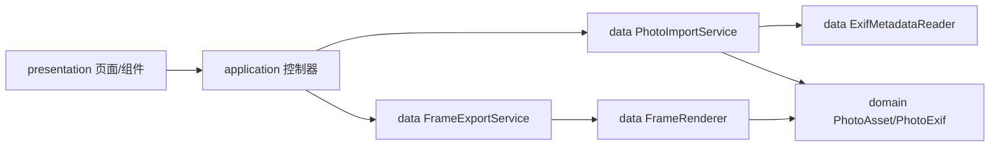

# 架构说明

## 目标

imgFrame 的核心目标是把照片导入、EXIF 解析、边框预览、离屏渲染和文件导出拆成稳定边界。这样后续新增模板、批量队列、导出配置和平台适配时，不需要重写页面层。

## 模块边界

## 数据流

1. `PhotoFramePage` 触发导入命令。
2. `PhotoFrameController` 调用 `PhotoImportService`。
3. `PhotoImportService` 选择文件、读取图片尺寸、解析 EXIF，产出 `PhotoAsset`。
4. 页面选择样式后，预览由 Flutter Widget 渲染。
5. 导出时 `FrameExportService` 调用 `FrameRenderer` 生成 PNG 字节。
6. `file_saver` 将 PNG 保存到目标平台。

## 扩展点

- 模板系统：新增 `FrameTemplate` 实体，并把 `FrameStyle` 升级为模板配置。
- 导出队列：在 `application` 增加任务状态，渲染移入 isolate。
- 字体系统：在 `data` 增加字体加载与文字排版服务。
- 历史记录：新增持久化服务，保存最近导入、最近导出和常用模板。
